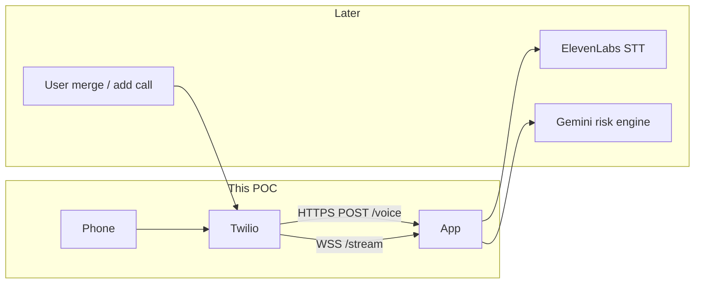
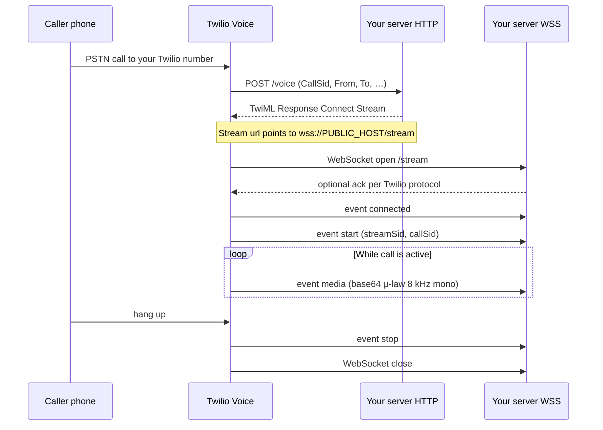

# Twilio inbound Media Streams — architecture

This POC is the first slice of ScamShield **call ingestion**: prove that when someone calls your Twilio number, Twilio can reach your server and push live audio over a WebSocket. ElevenLabs STT and conference merge come later.

## System context (ScamShield)



For the hack demo, the victim will **merge** the scam call with ScamShield’s number. That still arrives as an **inbound call** to your Twilio number, so this POC matches production ingestion.

## Call flow (this repo)



## Components

| Component | Where it runs | Responsibility |
|-----------|---------------|----------------|
| **Twilio phone number** | Twilio cloud | Receives inbound calls; triggers your webhook |
| **Voice webhook** | Your app `POST /voice` | Returns TwiML that connects the call to a Media Stream |
| **Media Stream WebSocket** | Your app `WSS /stream` | Receives JSON messages; `media` payloads are the audio |
| **Public tunnel** | ngrok / Cloudflare / hosted VM | Exposes localhost `3000` as public HTTPS + WSS |
| **`PUBLIC_BASE_URL`** | `.env` | Ensures TwiML `wss://…/stream` matches the tunnel hostname |

## Server endpoints

| Method / path | Visibility | Role |
|---------------|------------|------|
| `GET /health` | Public (optional) | Liveness; shows active stream count |
| `POST /voice` | **Must be public HTTPS** | Twilio “A call comes in” handler |
| `WS /stream` | **Must be public WSS** | Twilio Media Streams audio pipe |

Implementation: single Node process (`server.js`) — Express for HTTP, `ws` on the same HTTP server for `/stream`.

## Media Stream message types (handled in POC)

| Event | Meaning |
|-------|---------|
| `connected` | WebSocket session up; protocol version |
| `start` | Stream metadata (`streamSid`, `callSid`, tracks) |
| `media` | One chunk of audio; `media.payload` is base64 **μ-law (PCMU), 8000 Hz, mono** |
| `mark` | Synchronization marks (logged only in POC) |
| `stop` | Stream ended |

The POC **logs** frame counts and byte totals on `media`. It does not decode or forward to ElevenLabs yet.

## TwiML shape

When a call arrives, `/voice` responds with:

```xml
<Response>
  <Connect>
    <Stream url="wss://YOUR_PUBLIC_HOST/stream" />
  </Connect>
</Response>
```

`<Connect>` keeps the call leg active while Twilio streams audio to your WebSocket.

## Hosting constraints

- **Webhook** (`/voice`): short request/response — could live on serverless.
- **Media Stream** (`/stream`): **long-lived WebSocket** for the whole call — needs a persistent process (local + tunnel, Railway, Fly, Render, etc.).
- **Vercel-only**: not suitable for both endpoints in one POC; the stream cannot rely on short-lived serverless instances.

## Security (future, not POC)

- Validate `X-Twilio-Signature` on `POST /voice` using Auth Token.
- Optional token query param on `wss://…/stream?token=…` and reject bad connects.

## Related docs

- [README.md](./README.md) — Twilio console settings and how to start the server
