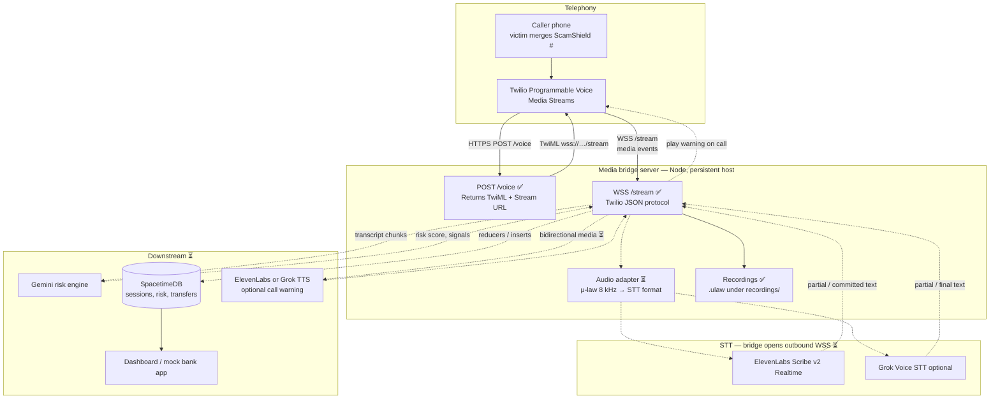
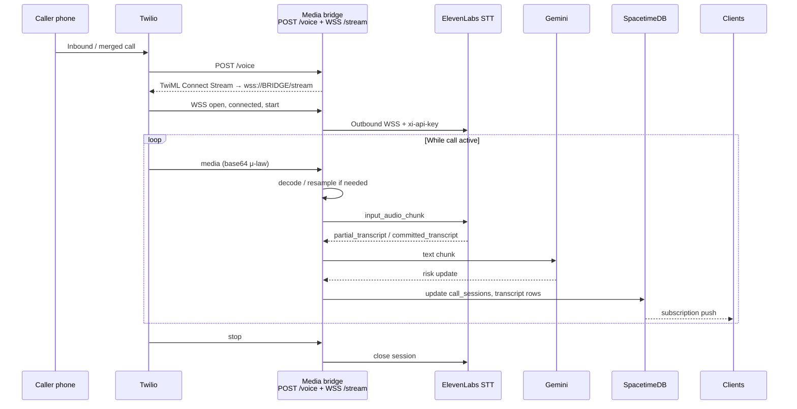

# Twilio inbound Media Streams — architecture

ScamShield ingests merged/scam calls through **Twilio Media Streams**. A **media bridge server** (this repo’s `server.js`) sits between Twilio and cloud STT/TTS—you cannot point Twilio directly at ElevenLabs or Grok Voice. **SpacetimeDB** holds live call and transfer state; it does not terminate the Twilio WebSocket (see [Bridge vs SpacetimeDB](#bridge-vs-spacetimedb)).

## Architecture (current POC + target)

Solid lines = **implemented today** in `Twilio/server.js`. Dotted lines = **planned** on the same bridge process.



**Legend:** ✅ in `server.js` today · ⏳ same bridge, not wired yet

### End-to-end sequence (with bridge + ElevenLabs)

Assumes ElevenLabs; Grok Voice STT uses the same bridge with a different adapter (see [STT provider options](#stt-provider-options)).



## Implementation status

| Piece | Location | Status |
|-------|----------|--------|
| Twilio → `POST /voice` → TwiML | Media bridge | ✅ |
| Twilio → `WSS /stream` → parse `media` | Media bridge | ✅ |
| Frame stats + optional `.ulaw` recordings | Media bridge | ✅ |
| Outbound WSS → ElevenLabs / Grok STT | Media bridge | ⏳ |
| Transcript → Gemini risk | Media bridge → Gemini | ⏳ |
| Live state → SpacetimeDB | Media bridge → STDB module | ⏳ |
| TTS warning injected on call (bidirectional stream) | Media bridge → Twilio | ⏳ |
| Conference / merge (multi-leg) | Twilio + bridge | ⏳ |

## Why STT cannot be the Twilio webhook or Stream URL

Twilio and cloud STT providers use **different protocols**. The **media bridge** is required.

| Integration | What Twilio needs | What STT APIs offer | Direct connect? |
|-------------|-------------------|---------------------|-----------------|
| Incoming call | `POST /voice` → **TwiML XML** with `<Stream url="wss://…"/>` | No Twilio voice webhook | **No** |
| Live audio | Twilio **connects to you** as WSS server; JSON `connected`, `start`, `media`, `stop`; `media.payload` = base64 **μ-law 8 kHz** | Your app **connects to them** as WSS client with provider messages + API key | **No** |

You cannot set `<Stream url="wss://api.elevenlabs.io/…"/>` and expect transcription. Batch `POST` file upload on ElevenLabs/xAI is for files/URLs, not live Media Streams.

References: [ElevenLabs realtime STT](https://elevenlabs.io/docs/api-reference/speech-to-text/v-1-speech-to-text-realtime), [ElevenLabs server-side streaming](https://elevenlabs.io/docs/eleven-api/guides/how-to/speech-to-text/realtime/server-side-streaming), [xAI streaming STT](https://docs.x.ai/developers/model-capabilities/audio/speech-to-text), [Twilio Media Streams](https://www.twilio.com/docs/voice/media-streams).

## Bridge vs SpacetimeDB

| Role | Media bridge (`server.js`) | SpacetimeDB |
|------|----------------------------|-------------|
| Twilio `WSS /stream` for whole call | ✅ Must run here | ❌ Not supported (HTTP handlers are sync; `/subscribe` is STDB protocol only) |
| Outbound STT/TTS WebSockets | ✅ | ❌ Procedures: short HTTP only |
| `call_sessions`, `transfer_intents`, live risk | Writes via client / `call` reducer | ✅ Subscriptions to UI |
| Optional `POST /voice` TwiML on STDB route | Could duplicate; Stream URL still points at **bridge** WSS | Partial |

For the hack demo, the victim **merges** the scam call with ScamShield’s Twilio number—it still arrives as an **inbound call**, so this POC matches production ingestion.

## STT provider options (same bridge, different adapter)

| Provider | Endpoint (bridge opens as **client**) | Twilio μ-law 8 kHz | Live partial text |
|----------|----------------------------------------|--------------------|-------------------|
| **ElevenLabs Scribe v2 Realtime** | `wss://api.elevenlabs.io/v1/speech-to-text/realtime?model_id=scribe_v2_realtime` | Usually μ-law → **PCM 16 kHz**, base64 `input_audio_chunk` | `partial_transcript`, `committed_transcript` |
| **Grok Voice STT** | `wss://api.x.ai/v1/stt?encoding=mulaw&sample_rate=8000&interim_results=true` | Raw **μ-law** binary frames | `transcript.partial`, `transcript.done` |

API keys live on the **bridge only** (`ELEVENLABS_API_KEY`, `XAI_API_KEY`).

**Grok speech-to-speech** (`wss://api.x.ai/v1/realtime`) is a full voice agent path—not required for silent third-party listen + Gemini scoring. See [xAI speech-to-speech](https://docs.x.ai/developers/model-capabilities/audio/speech-to-speech).

## Components

| Component | Where it runs | Responsibility |
|-----------|---------------|----------------|
| **Twilio phone number** | Twilio cloud | Receives inbound calls; triggers webhook |
| **Media bridge** | Fly / Railway / ngrok + Node | `POST /voice`, `WSS /stream`, STT/TTS adapters, calls Gemini, writes STDB |
| **ElevenLabs / Grok** | Vendor cloud | Realtime STT (and optional TTS) |
| **SpacetimeDB** | Maincloud / self-host | Live sessions, risk, transfer gating |
| **Public tunnel** | ngrok / Cloudflare | Exposes bridge as public HTTPS + WSS |
| **`PUBLIC_BASE_URL`** | `.env` on bridge | TwiML `wss://…/stream` matches public host |

## Server endpoints (media bridge)

| Method / path | Visibility | Role |
|---------------|------------|------|
| `GET /health` | Public (optional) | Liveness; active stream count |
| `POST /voice` | **Public HTTPS** | Twilio voice webhook → TwiML |
| `WS /stream` | **Public WSS** | Twilio Media Streams audio pipe |

Implementation: single Node process (`server.js`) — Express for HTTP, `ws` on the same HTTP server for `/stream`.

## Media Stream message types (handled in POC)

| Event | Meaning |
|-------|---------|
| `connected` | WebSocket session up; protocol version |
| `start` | Stream metadata (`streamSid`, `callSid`, tracks) |
| `media` | Audio chunk; `media.payload` = base64 **μ-law (PCMU), 8000 Hz, mono** |
| `mark` | Synchronization marks (logged only in POC) |
| `stop` | Stream ended |

## TwiML shape

```xml
<Response>
  <Connect>
    <Stream url="wss://YOUR_PUBLIC_HOST/stream" />
  </Connect>
</Response>
```

`<Connect>` keeps the call leg active while Twilio streams audio to the **bridge** WebSocket.

## Hosting constraints

- **`/voice`**: short request/response — could theoretically live elsewhere; **`/stream` must stay on the bridge**.
- **`/stream`**: long-lived WebSocket for the entire call — persistent process (not Vercel serverless-only).
- **SpacetimeDB**: host the module and subscriptions; do not move Media Streams ingestion into the module.

## Security (future)

- Validate `X-Twilio-Signature` on `POST /voice`.
- Optional token on `wss://…/stream?token=…`.

## Related docs

- [README.md](./README.md) — Twilio console settings and how to start the server
